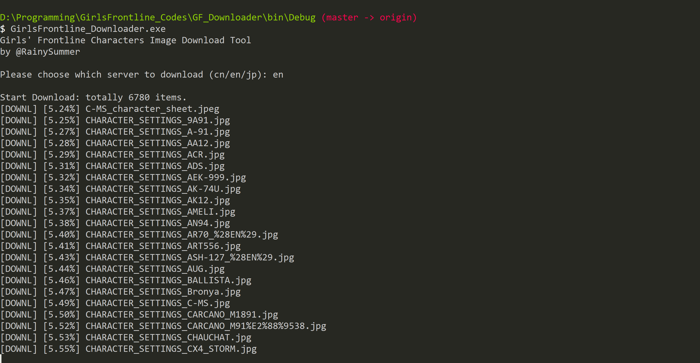
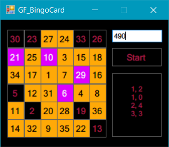

# GirlsFrontline

## GF_Downloader

Girls' Frontline Characters Image Download Tool

You can download from GF wiki of CN/EN/JP.

For CN's Girls' Frontline wiki has a specific naming rule for the characters image (a `PIC_` prefix), and therefore these can be specifically downloaded.
For EN's wiki, we use a mechanism of downloading only the images that are `png`, with the same width and height (a square one), and width and height are at least `1024px`.
And for JP's wiki, we download the images that have the word `立絵` in their titles.

JP's wiki has a slow speed, at least for the network here. And the image resolution is worse than the other wiki sites.

TODO: [GFLDB](https://gfl.zzzzz.kr/?lang=en), a (KR?) GF database, which has very high-resolution resources.

Features:

1. Support filenames in none-English characters.
2. For 404 and other server-error files, a blank file with the file name will be created.
3. If accidentally exit the tool, the download will automatically continue after rerunning the tool.

## GF_BingoCard

